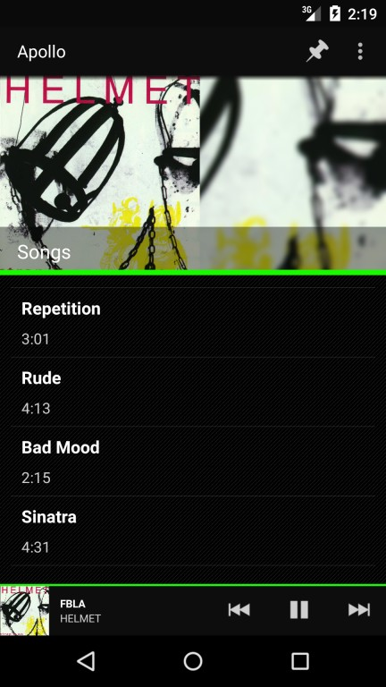
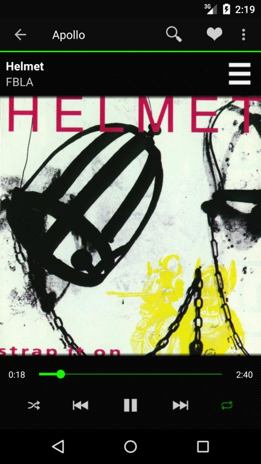
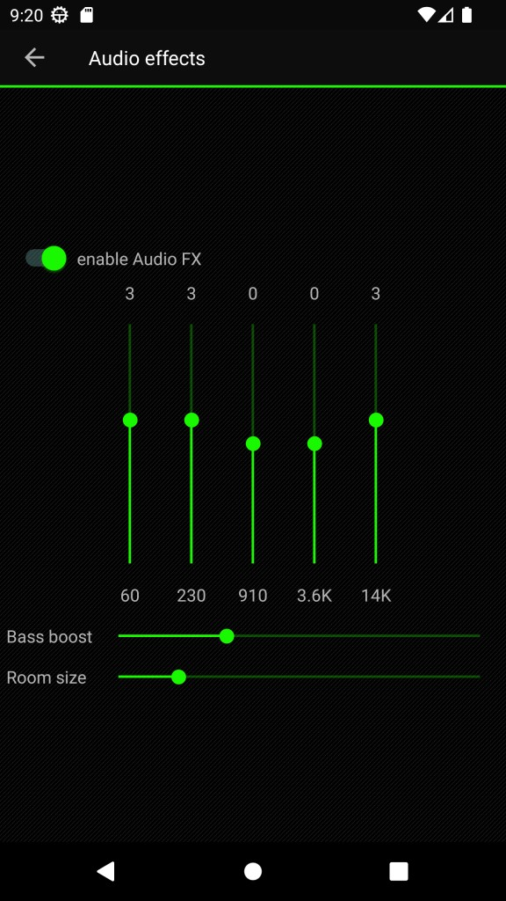

# Apollo Music Player

Apollo is a fork from CyanogenMod's <a href="https://github.com/adneal/Apollo-CM">Apollo<a/> music player, supporting Android 5.0+

This version of Apollo is a fork from the <a href="https://codeberg.org/nuclearfog/Apollo">Apollo<a/> music player, but improved support for modern android (15+).

Or download the latest APK from the <b>releases</b> section.

## What's new

- integrated equalizer
- playlist with the most listened songs
- new media playback controls
- hide tracks from view
- online artwork browser

## Screenshots
  

## Translations
Please help with translation on the [Weblate](https://toolate.othing.xyz/projects/apollo-player/)

## Contributing
For more information please read the <a href="CONTRIBUTING.md">contribution guidelines</a>
